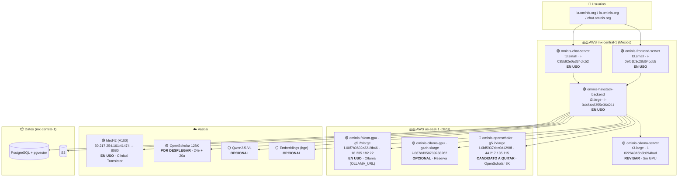
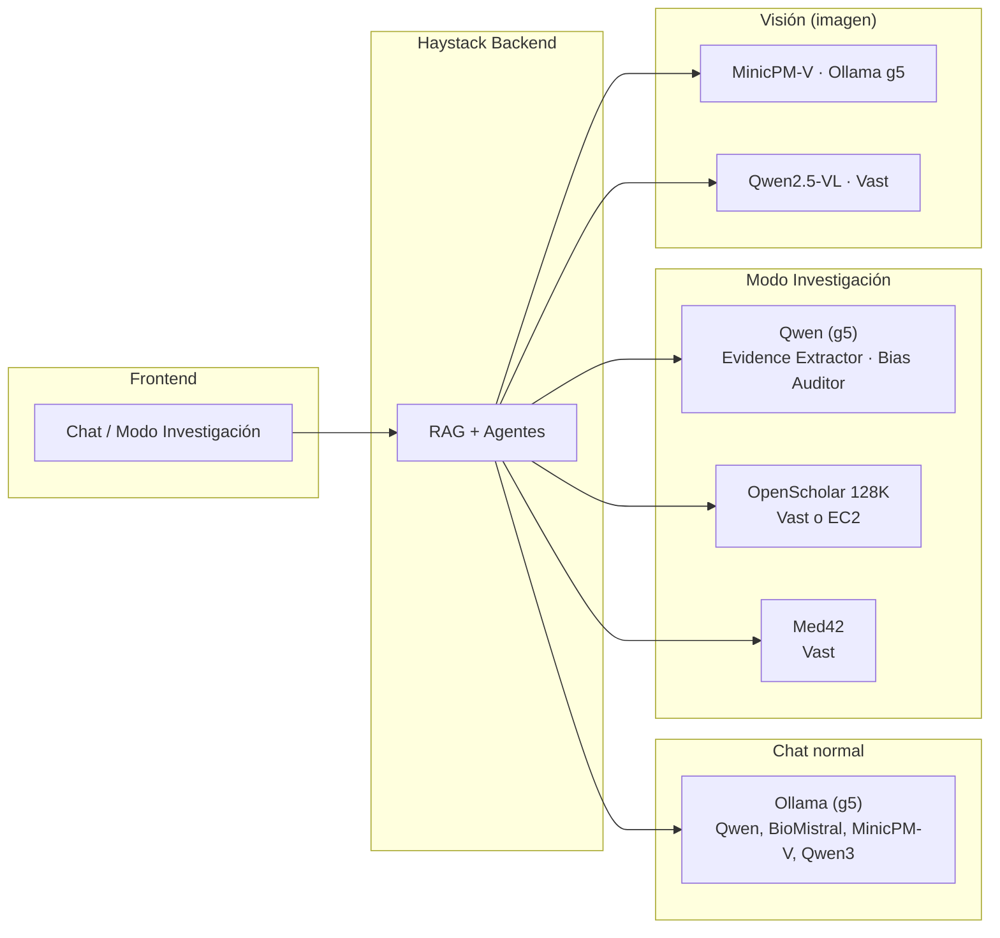

# Arquitectura actual: qué está en uso y qué no

Este documento tiene diagramas para ver de un vistazo todos los componentes, en qué región viven y cuáles están en uso o son candidatos a eliminar.

---

## 1. Vista general (regiones e instancias)

**Leyenda**
- **🟢 EN USO** — Imprescindible hoy.
- **🟡 REVISAR / OPCIONAL** — Confirmar si se usa; si no, se puede apagar.
- **🔴 CANDIDATO A QUITAR** — Se puede eliminar cuando el reemplazo en Vast esté estable.
- **⚪ OPCIONAL** — Pensado para más adelante (fase experimental).

---

## 2. Flujo de inferencia: qué modelo usa cada ruta

| Ruta | Origen actual | En uso / Candidato |
|------|----------------|--------------------|
| Chat (Ominis 2.0, Med, Clinic, Open, Power) | Ollama g5 / vLLM EC2 | g5 **en uso** |
| Modo Investigación (síntesis) | OpenScholar 8K (EC2) o 128K (Vast) | 8K EC2 **candidato a quitar** si 128K en Vast |
| Clinical Translator (tras reporte) | Med42 Vast | **En uso** (configurar `MED42_API_URL`) |
| Evidence Extractor / Bias Auditor | Qwen en g5 | **En uso** |
| Análisis de imagen | MinicPM-V (g5) o Qwen2.5-VL (Vast) | g5 **en uso**; Qwen-VL **opcional** |
| Embeddings (RAG) | In-process (SentenceTransformers) o bge Vast | In-process **en uso**; bge **opcional** |

---

## 3. Tabla resumen: instancias y decisión

| Instancia | Región | Tipo | Rol | Decisión |
|-----------|--------|------|-----|----------|
| ominis-frontend-server | mx-central-1 | t3.small | UI | **Mantener** |
| ominis-haystack-backend | mx-central-1 | t3.large | API RAG/agentes | **Mantener** |
| ominis-chat-server | mx-central-1 | t3.small | Chat | **Mantener** |
| ominis-ollama-server | mx-central-1 | t3.large | Sin GPU | **Revisar** → candidata a quitar |
| ominis-falcon-gpu | us-east-1 | g5.2xlarge | Ollama (OLLAMA_URL) | **Mantener** (chat + visión) |
| ominis-ollama-gpu | us-east-1 | g4dn.xlarge | Ollama reserva | **Opcional** → quitar si no se usa |
| ominis-openscholar | us-east-1 | g5.2xlarge | OpenScholar 8K | **Quitar** cuando 128K en Vast esté estable |
| Med42 | Vast.ai | A100 | Clinical Translator | **En uso** |
| OpenScholar 128K | Vast.ai | A100 | Modo Investigación largo | **Desplegar** (24e + 20a) |

---

## 4. Cómo ver los diagramas Mermaid

- **GitHub**: al abrir este `.md` en el repo, GitHub renderiza los bloques `mermaid`.
- **VS Code / Cursor**: extensión "Mermaid" o vista previa con Mermaid.
- **Online**: copiar el bloque de código en [mermaid.live](https://mermaid.live) y ver/exportar el diagrama.

Si quieres, el siguiente paso puede ser dejar este doc como referencia única y enlazarlo desde `ARCHITECTURE.md` y `VAST_DEPLOY_AND_EC2_CLEANUP.md`.
